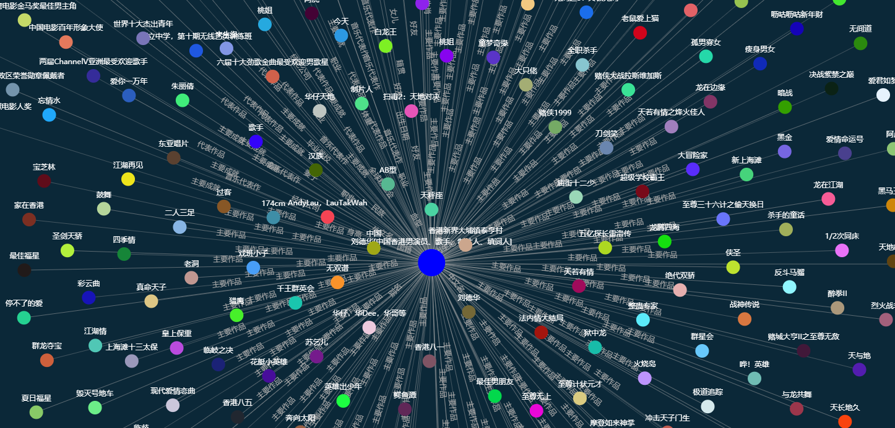

<h1 align = "center">史上最大规模1.4亿中文知识图谱开源下载</h1>



知识就是力量，知识图谱是人工智能新时代的产物，简单地说知识图谱就是通过关联关系将知识组成网状的结构，然后我们的人工智能可以通过这个图谱来认识其代表的这一个现实事件，这个事件可以是现实，也可以是虚构的。

知识图谱可以应用于机器人问答系统，知识推荐等等，下图为知识图谱在机器人上的应用。


本次ownthink开源了史上最大规模的中文知识图谱，数据是以（实体、属性、值），（实体、关系、实体）混合的形式组织，数据格式采用csv格式，下载链接见文末。

解压后查看知识图谱规模：
```shell
$ wc -l ownthink_v2.csv
140919781 ownthink_v2.csv
```

查看知识图谱数据：
```shell
$ head ownthink_v2.csv
实体,属性,值
胶饴,描述,别名: 饴糖、畅糖、畅、软糖。
词条,描述,词条（拼音：cí tiáo）也叫词目，是辞书学用语，指收列的词语及其释文。
词条,标签,文化
红色食品,描述,红色食品是指食品为红色、橙红色或棕红色的食品。
红色食品,中文名,红色食品
红色食品,是否含防腐剂,否
红色食品,主要食用功效,预防感冒，缓解疲劳
红色食品,适宜人群,全部人群
红色食品,用途,增强表皮细胞再生和防止皮肤衰老
```

使用python进行读取测试：
```python3
import sys
import csv

with open('ownthink_v2.csv', 'r', encoding='utf8') as fin:
  reader = csv.reader(fin)
  for index, read in enumerate(reader):
    print(read)
    
    if index > 10:
      sys.exit(0)
```

运行以上脚本输出结果：
```shell
['实体', '属性', '值']
['胶饴', '描述', '别名: 饴糖、畅糖、畅、软糖。']
['词条', '描述', '词条（拼音：cí tiáo）也叫词目，是辞书学用语，指收列的词语及其释文。']
['词条', '标签', '文化']
['红色食品', '描述', '红色食品是指食品为红色、橙红色或棕红色的食品。']
['红色食品', '中文名', '红色食品']
['红色食品', '是否含防腐剂', '否']
['红色食品', '主要食用功效', '预防感冒，缓解疲劳']
['红色食品', '适宜人群', '全部人群']
['红色食品', '用途', '增强表皮细胞再生和防止皮肤衰老']
['红色食品', '标签', '非科学']
['红色食品', '标签', '生活']
```

数据下载方式：

* 关注思知机器人回复【数据下载】获取下载链接

* 百度网盘（链接: https://pan.baidu.com/s/1LZjs9Dsta0yD9NH-1y0sAw 提取码: 3hpp ）注：解压密码是：https://www.ownthink.com/

```shell
加入qq群：
人工智能qq群1：90780053(满)
人工智能qq群2：956936481（满）
人工智能qq群3：1160292084（满）
人工智能qq群4：1019825236
知识图谱qq群1：55152968（满）
知识图谱qq群2：740104333（满）
知识图谱qq群3：586457987
```

